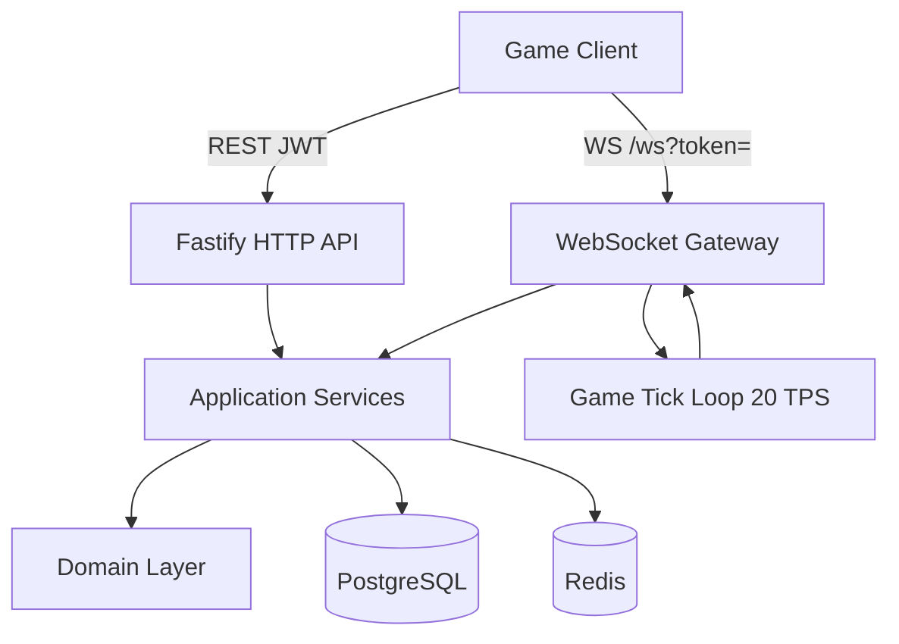
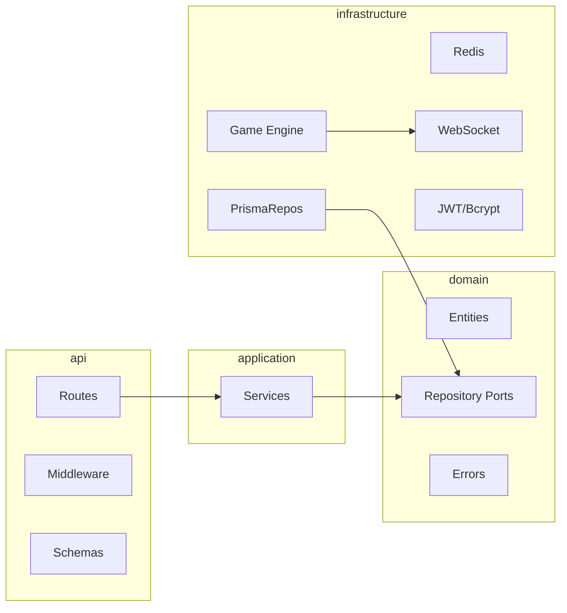
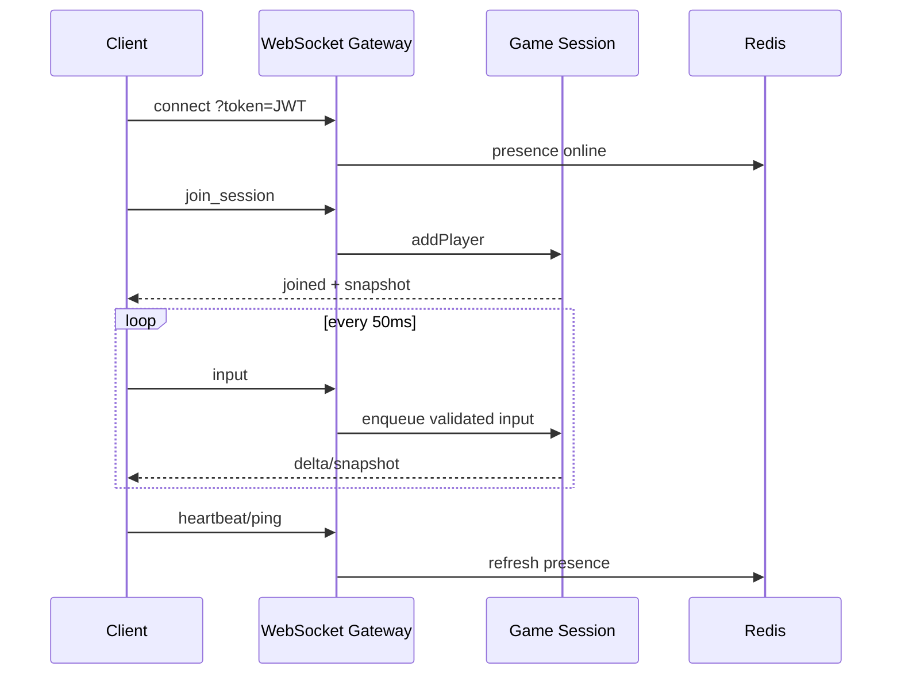
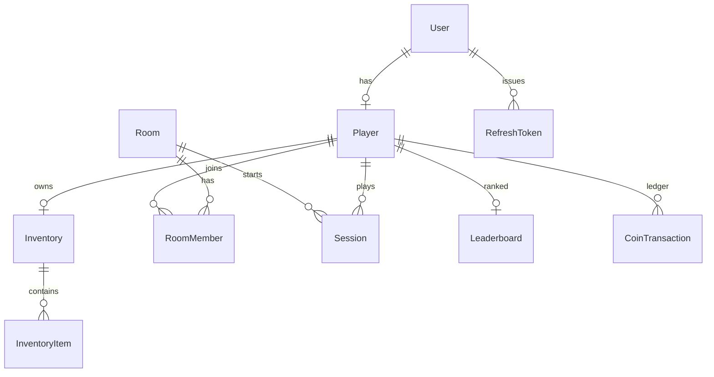

# Authoritative Multiplayer Game Server


A reference implementation of a **server-authoritative multiplayer backend**, designed to demonstrate production-oriented backend architecture and realtime networking patterns used in competitive online games.

This project is **not** a complete game client. It covers authentication, persistent player progression, lobbies, authoritative realtime sessions, inventory/economy boundaries, Redis-backed presence/rate limiting, and automated CI.

## Highlights

- Server-authoritative movement at 20 TPS
- Snapshot and delta synchronization
- PostgreSQL-backed inventory and economy
- Redis presence and rate limiting
- JWT authentication with refresh-token rotation
- Dockerized local environment and CI

## Features

- JWT access + refresh token authentication with bcrypt password hashing
- Player profiles with XP, coins, and equipment slots
- Persistent inventory (PostgreSQL + Prisma)
- Lobby system: create / join / leave / ready / start with capacity checks
- Authoritative realtime game sessions over WebSocket
- 20 TPS tick loop with snapshot + delta synchronization
- Heartbeat, ping/RTT, disconnect detection, reconnect tokens
- Movement validation and basic anti-cheat (speed / position / input sequencing)
- Coin economy with transactional ledger entries
- Experience leaderboard
- Redis presence, session cache, and rate limiting
- Privileged grant/credit mutations behind admin API key
- Docker Compose one-command local stack
- Vitest unit/integration tests + GitHub Actions CI

## Load Test Evidence

### HTTP pressure (autocannon)

The Docker Compose stack (`api` + `postgres` + `redis`) was exercised with **autocannon** to validate process stability under concurrent HTTP pressure. The API stayed healthy with **0 crashes**.

| What we measured | Result |
| --- | --- |
| Stack after load | **healthy** · Redis **ready** |
| Process errors / crashes | **0** |
| `/health` under concurrent load | **100% success** |
| Authenticated routes under abuse | Redis rate limiter returned **429**, API kept serving |

These results demonstrate infrastructure survival and rate-limit behavior. Peak RPS on `/health` is intentionally de-emphasized because that endpoint is lightweight and not representative of gameplay traffic.


<details>
<summary>Additional HTTP load-test evidence</summary>


Raw numbers live in [`docs/load-test/results.json`](docs/load-test/results.json).

</details>

```bash
docker compose up --build -d
npm run load:test
npm run load:report
# open docs/load-test/report.html
```

### WebSocket game-session load

A custom harness bootstrapped **25 rooms × 8 players**, connected **200** WebSocket clients, streamed movement intent at **20 Hz** for 30s, and sampled reconnects against the live Docker stack.

| What we measured | Result |
| --- | --- |
| Clients joined | **200 / 200** |
| Observed tick rate | **~21.7 TPS** (target 20) |
| Input acks | **118,600 / 118,600** (0 drops) |
| Input-ack latency | **p50 14.2 ms · p95 34.8 ms · p99 56 ms** |
| Reconnect sample | **40 / 40 (100%)** |
| Protocol errors | **0** |
| Stack after load | **healthy** · Redis **ready** |

This exercises the authoritative path (lobby → join → intent → snapshot/delta fan-out → reconnect), not HTTP `/health` throughput.


<details>
<summary>Additional WebSocket load-test evidence</summary>


Raw numbers live in [`docs/load-test/ws-results.json`](docs/load-test/ws-results.json).

</details>

```bash
docker compose up --build -d
npm run load:ws
npm run load:ws-report
# open docs/load-test/ws-report.html
```

## Design Decisions

- Fastify was selected for low-overhead HTTP routing and schema-driven request handling.
- WebSocket state is kept in memory for low-latency simulation, while PostgreSQL stores persistent progression.
- Redis is used only for ephemeral cross-process concerns such as presence and rate limiting.
- Clients submit movement intent rather than absolute position updates.
- Repository interfaces isolate application services from Prisma-specific persistence code.
- Item grants and coin credits are admin-only (`x-admin-key`); player JWTs cannot mint economy state.
- JWT secrets and DB/Redis passwords must be supplied via environment; production rejects placeholder secrets.
- Auth routes use a stricter rate limit than the global API budget.

## Tech Stack

| Layer | Technology |
| --- | --- |
| Runtime | Node.js 20+, TypeScript |
| HTTP | Fastify |
| Realtime | `ws` (WebSocket) |
| Validation | Zod |
| ORM / DB | Prisma + PostgreSQL |
| Cache | Redis (ioredis) |
| Auth | JWT + bcrypt |
| Tests | Vitest |
| Quality | ESLint, Prettier |
| Ops | Docker, Docker Compose, GitHub Actions |

## Architecture



### Clean architecture layout



## Folder Structure

```text
src/
  api/                 # HTTP routes, middleware, Zod schemas
  application/         # Use-case services
  domain/              # Entities, repository ports, errors
  infrastructure/      # Prisma, Redis, JWT, WebSocket, game loop
  modules/             # Feature re-exports
  shared/              # Config, constants, DI container
  app.ts               # Fastify app factory
  server.ts            # Process bootstrap
prisma/
  schema.prisma
  migrations/
tests/
  unit/
  integration/
docker/
.github/workflows/
```

## Quick Start (Docker)

```bash
cp .env.example .env
docker compose up --build
```

Services:

| Service | URL |
| --- | --- |
| API | http://localhost:3000 |
| WebSocket | ws://localhost:3000/ws |
| PostgreSQL | localhost:5432 |
| Redis | localhost:6379 |
| Health | GET /health |

Stop:

```bash
docker compose down
```

## Local Development

Requirements: Node.js 20+, Docker (for Postgres/Redis), npm.

```bash
cp .env.example .env
docker compose up -d postgres redis
npm install
npx prisma generate
npx prisma migrate deploy
npm run dev
```

Useful scripts:

```bash
npm run lint
npm test
npm run build
npm run prisma:studio
```

## API Examples

### Register

```bash
curl -s -X POST http://localhost:3000/auth/register \
  -H 'content-type: application/json' \
  -d '{"email":"ace@example.com","username":"Ace","password":"password123"}'
```

### Login

```bash
curl -s -X POST http://localhost:3000/auth/login \
  -H 'content-type: application/json' \
  -d '{"email":"ace@example.com","password":"password123"}'
```

### Player profile

```bash
curl -s http://localhost:3000/players/me \
  -H "authorization: Bearer $ACCESS_TOKEN"
```

### Inventory

```bash
curl -s http://localhost:3000/inventory \
  -H "authorization: Bearer $ACCESS_TOKEN"

curl -s -X POST http://localhost:3000/inventory/remove \
  -H "authorization: Bearer $ACCESS_TOKEN" \
  -H 'content-type: application/json' \
  -d '{"itemKey":"sword_iron","quantity":1}'
```

> Privileged mutations such as granting items or crediting coins are **not** available on player JWT routes.
> Use `/admin/*` with `x-admin-key` (requires `ADMIN_API_KEY`). If the key is unset, those routes stay disabled.

### Lobby

```bash
curl -s -X POST http://localhost:3000/lobby/rooms \
  -H "authorization: Bearer $ACCESS_TOKEN" \
  -H 'content-type: application/json' \
  -d '{"name":"Ranked Arena","maxPlayers":4}'

curl -s -X POST http://localhost:3000/lobby/rooms/join \
  -H "authorization: Bearer $ACCESS_TOKEN" \
  -H 'content-type: application/json' \
  -d '{"code":"ABC123"}'

curl -s -X POST http://localhost:3000/lobby/rooms/ready \
  -H "authorization: Bearer $ACCESS_TOKEN" \
  -H 'content-type: application/json' \
  -d '{"ready":true}'

curl -s -X POST http://localhost:3000/lobby/rooms/start \
  -H "authorization: Bearer $ACCESS_TOKEN"
```

### Economy + Leaderboard

```bash
curl -s http://localhost:3000/economy/balance \
  -H "authorization: Bearer $ACCESS_TOKEN"

curl -s 'http://localhost:3000/leaderboard?limit=10'
```

### Admin grants (local testing)

```bash
curl -s -X POST http://localhost:3000/admin/inventory/grant \
  -H "x-admin-key: $ADMIN_API_KEY" \
  -H 'content-type: application/json' \
  -d '{"playerId":"'"$PLAYER_ID"'","itemKey":"sword_iron","name":"Iron Sword","quantity":1}'

curl -s -X POST http://localhost:3000/admin/economy/credit \
  -H "x-admin-key: $ADMIN_API_KEY" \
  -H 'content-type: application/json' \
  -d '{"playerId":"'"$PLAYER_ID"'","amount":50,"reason":"quest_reward"}'
```

## WebSocket Protocol

Connect:

```text
ws://localhost:3000/ws
Authorization: Bearer <ACCESS_TOKEN>
```

Query-string tokens (`?token=`) are supported for browser clients but can leak via logs/proxies; prefer the Authorization header when possible.

### Client → Server

| type | purpose |
| --- | --- |
| `join_session` | Enter a room's authoritative session (`roomId`, optional `reconnectToken`) |
| `input` | Movement intent (`seq`, `dt`, `move`, `look`) |
| `ping` | Latency probe (`clientTime`) |
| `heartbeat` | Keepalive / presence refresh |
| `request_snapshot` | Force full state resync |

Example input:

```json
{
  "type": "input",
  "seq": 42,
  "dt": 0.05,
  "move": { "x": 1, "y": 0, "z": 0 },
  "look": { "x": 0, "y": 1.57, "z": 0 }
}
```

### Server → Client

| type | purpose |
| --- | --- |
| `joined` | Session accepted + reconnect token |
| `snapshot` | Full world state |
| `delta` | Changed fields since previous tick |
| `pong` | Ping response |
| `input_ack` | Last accepted input sequence |
| `heartbeat` | Heartbeat ack |
| `error` | Protocol / auth / validation error |



### Authoritative simulation rules

- Server owns position, rotation, velocity, HP, connectivity, and ping
- Clients send intents only; they never write world state
- Inputs are sequenced, rate-limited, schema-validated, and speed-checked
- Full snapshots every ~1s; deltas otherwise

## Database Schema



Core models: `User`, `Player`, `Inventory`, `InventoryItem`, `Room`, `RoomMember`, `Session`, `Leaderboard`, `RefreshToken`, `CoinTransaction`.

## Redis Usage

| Key pattern | Purpose |
| --- | --- |
| `presence:{playerId}` | Online presence with TTL |
| `session:{sessionId}` | Ephemeral session cache |
| `ratelimit:*` | WS + HTTP rate limiting counters |

## Testing & CI

```bash
npm test
npm run lint
npm run build
```

GitHub Actions workflow (`.github/workflows/ci.yml`):

1. Boot Postgres + Redis service containers
2. Install dependencies
3. Prisma generate + migrate
4. Lint, typecheck, test
5. Build TypeScript
6. Build Docker image

## Configuration

See `.env.example` for all knobs:

- `GAME_TICK_RATE` (default `20`)
- `MAX_MOVE_SPEED`
- `HEARTBEAT_TIMEOUT_MS`
- `WS_RATE_LIMIT_PER_SECOND`
- `ADMIN_API_KEY` (optional; required only to unlock `/admin/*`)
- JWT secrets and expiry windows

## Future Improvements

- WebSocket game-session load tests (concurrent clients, sustained 20 TPS, p95 input-to-broadcast latency, reconnect success)
- Horizontal scaling with Redis pub/sub fan-out across game nodes
- Interest management / AOI culling for large maps
- Binary protocols (MessagePack / FlatBuffers) for bandwidth
- Replay recording and anti-cheat telemetry pipelines
- Matchmaking MMR service
- Observability: OpenTelemetry traces, Prometheus metrics, Grafana dashboards
- Kubernetes Helm chart and blue/green deploys

## License

MIT
