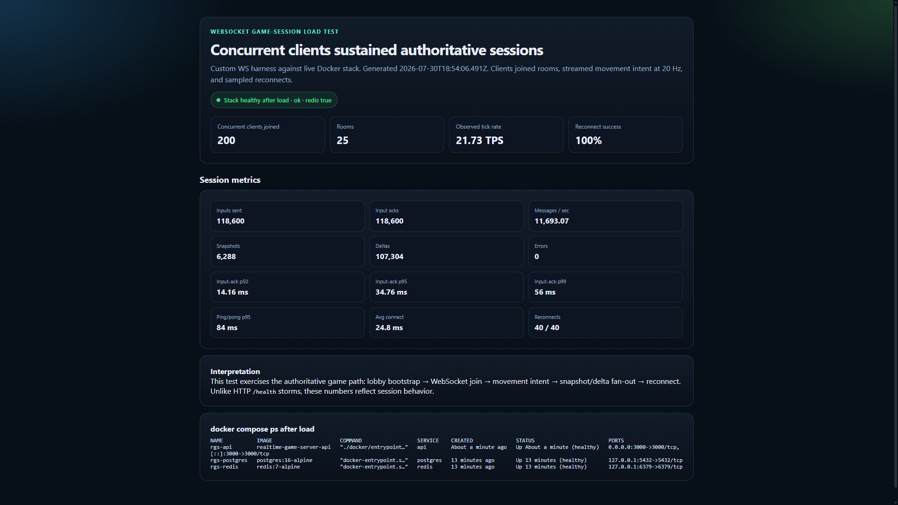
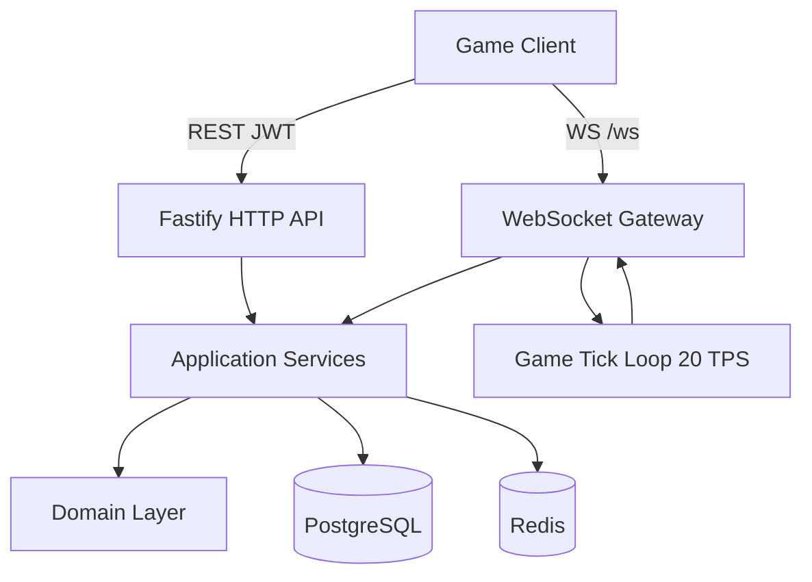
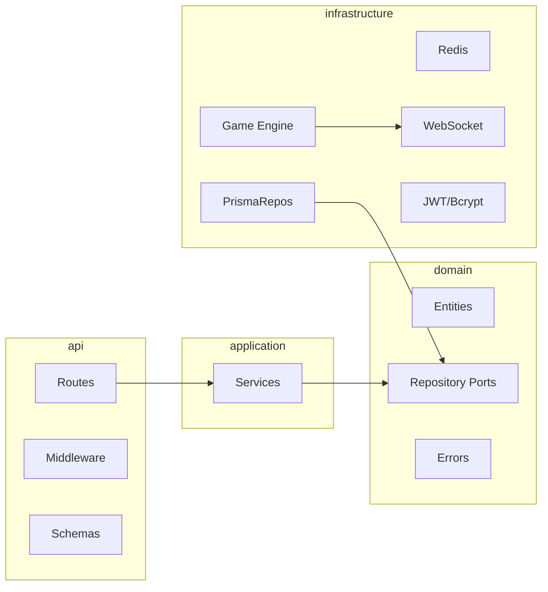
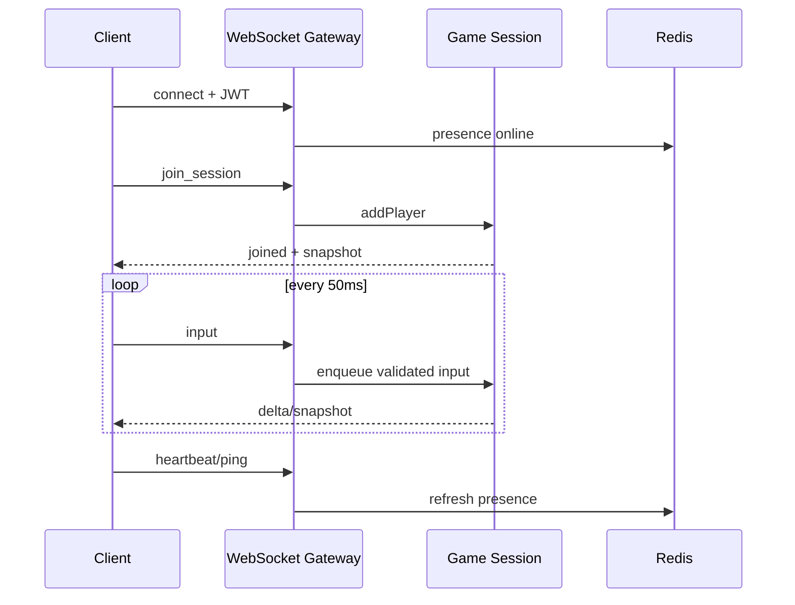
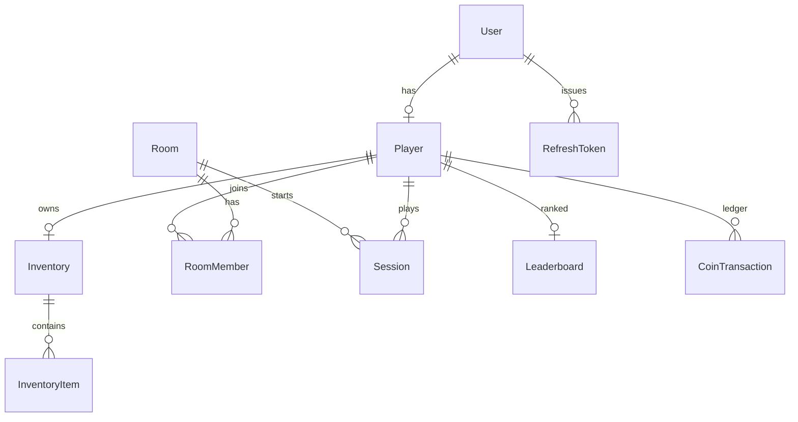

# Authoritative Multiplayer Game Server


Server-authoritative multiplayer backend — auth, lobbies, 20 TPS sessions, inventory/economy, Redis presence & rate limits. Not a game client; the networking and progression layer competitive games sit on.

**Stack:** TypeScript · Fastify · `ws` · PostgreSQL/Prisma · Redis · JWT · Zod · Vitest · Docker · GitHub Actions

---

## Load evidence

200 concurrent WebSocket clients on the live Docker stack (`api` + Postgres + Redis): lobby bootstrap → join → 20 Hz movement intent → snapshot/delta fan-out → reconnect.

| Metric | Result |
| --- | --- |
| Clients joined | **200 / 200** |
| Tick rate | **~21.7 TPS** (target 20) |
| Input acks | **118,600 / 118,600** |
| Input-ack latency | **p50 14 ms · p95 35 ms · p99 56 ms** |
| Reconnects | **40 / 40** |
| Errors | **0** |
| After load | healthy · Redis ready |


<details>
<summary>Full WS report · raw JSON · reproduce</summary>



[`ws-results.json`](docs/load-test/ws-results.json) · [`ws-report.html`](docs/load-test/ws-report.html)

```bash
docker compose up --build -d
npm run load:ws
npm run load:ws-report
```

</details>

<details>
<summary>HTTP pressure (autocannon) — process survival, not gameplay capacity</summary>

Stack stayed healthy under concurrent HTTP load; abused auth routes returned **429** via Redis. `/health` RPS is not a gameplay claim.


[`results.json`](docs/load-test/results.json) · `npm run load:test && npm run load:report`

</details>

---

## What it does

| Area | Details |
| --- | --- |
| Auth | JWT access + refresh rotation, bcrypt, strict auth rate limits |
| Players | Profiles, XP, coins, equipment slots |
| Lobby | Create / join / leave / ready / start with capacity checks |
| Realtime | WebSocket sessions, 20 TPS loop, snapshot + delta sync |
| Resilience | Heartbeat, ping/RTT, reconnect tokens, one connection per player |
| Anti-cheat | Sequenced intents, speed / position checks, schema validation |
| Economy | Transactional coin ledger; grants require admin API key |
| Ops | Redis presence & rate limits, Docker Compose, CI |

**Design notes:** clients send movement *intent*, never absolute position. Simulation state stays in memory; Postgres holds progression. Redis is for ephemeral concerns only (presence, rate limits, session cache).

## Tech stack

| Layer | Technology |
| --- | --- |
| Runtime | Node.js 20+, TypeScript |
| HTTP | Fastify |
| Realtime | `ws` |
| Validation | Zod |
| ORM / DB | Prisma + PostgreSQL |
| Cache | Redis (ioredis) |
| Auth | JWT + bcrypt |
| Tests | Vitest |
| Quality | ESLint, Prettier |
| Ops | Docker Compose, GitHub Actions |

## Architecture





```text
src/
  api/                 # routes, middleware, Zod schemas
  application/         # use-case services
  domain/              # entities, repository ports, errors
  infrastructure/      # Prisma, Redis, JWT, WebSocket, game loop
  modules/             # feature re-exports
  shared/              # config, constants, DI container
prisma/
tests/
docker/
.github/workflows/
```

## Quick start

```bash
cp .env.example .env
docker compose up --build
```

| Service | URL |
| --- | --- |
| API | http://localhost:3000 |
| WebSocket | ws://localhost:3000/ws |
| Health | GET /health |

Local (Postgres/Redis via Compose):

```bash
cp .env.example .env
docker compose up -d postgres redis
npm install
npx prisma generate && npx prisma migrate deploy
npm run dev
```

```bash
npm run lint && npm test && npm run build
```

## API examples

### Auth & profile

```bash
curl -s -X POST http://localhost:3000/auth/register \
  -H 'content-type: application/json' \
  -d '{"email":"ace@example.com","username":"Ace","password":"password123"}'

curl -s -X POST http://localhost:3000/auth/login \
  -H 'content-type: application/json' \
  -d '{"email":"ace@example.com","password":"password123"}'

curl -s http://localhost:3000/players/me \
  -H "authorization: Bearer $ACCESS_TOKEN"
```

### Lobby

```bash
curl -s -X POST http://localhost:3000/lobby/rooms \
  -H "authorization: Bearer $ACCESS_TOKEN" \
  -H 'content-type: application/json' \
  -d '{"name":"Ranked Arena","maxPlayers":4}'

curl -s -X POST http://localhost:3000/lobby/rooms/join \
  -H "authorization: Bearer $ACCESS_TOKEN" \
  -H 'content-type: application/json' \
  -d '{"code":"ABC123"}'

curl -s -X POST http://localhost:3000/lobby/rooms/ready \
  -H "authorization: Bearer $ACCESS_TOKEN" \
  -H 'content-type: application/json' \
  -d '{"ready":true}'

curl -s -X POST http://localhost:3000/lobby/rooms/start \
  -H "authorization: Bearer $ACCESS_TOKEN"
```

### Inventory, economy, leaderboard

```bash
curl -s http://localhost:3000/inventory \
  -H "authorization: Bearer $ACCESS_TOKEN"

curl -s http://localhost:3000/economy/balance \
  -H "authorization: Bearer $ACCESS_TOKEN"

curl -s 'http://localhost:3000/leaderboard?limit=10'
```

Item grants and coin credits are **admin-only** (`/admin/*` + `x-admin-key`). Player JWTs cannot mint economy state. Routes stay disabled if `ADMIN_API_KEY` is unset.

```bash
curl -s -X POST http://localhost:3000/admin/inventory/grant \
  -H "x-admin-key: $ADMIN_API_KEY" \
  -H 'content-type: application/json' \
  -d '{"playerId":"'"$PLAYER_ID"'","itemKey":"sword_iron","name":"Iron Sword","quantity":1}'

curl -s -X POST http://localhost:3000/admin/economy/credit \
  -H "x-admin-key: $ADMIN_API_KEY" \
  -H 'content-type: application/json' \
  -d '{"playerId":"'"$PLAYER_ID"'","amount":50,"reason":"quest_reward"}'
```

## WebSocket protocol

```text
ws://localhost:3000/ws
Authorization: Bearer <ACCESS_TOKEN>
```

`?token=` works for browsers but can leak in logs; prefer the Authorization header.

| Client → server | Purpose |
| --- | --- |
| `join_session` | Enter session (`roomId`, optional `reconnectToken`) |
| `input` | Movement intent (`seq`, `dt`, `move`, `look`) |
| `ping` / `heartbeat` | Latency + presence |
| `request_snapshot` | Full state resync |

| Server → client | Purpose |
| --- | --- |
| `joined` | Accept + reconnect token |
| `snapshot` / `delta` | World state |
| `input_ack` / `pong` / `heartbeat` | Acks |
| `error` | Auth / validation / protocol |

```json
{
  "type": "input",
  "seq": 42,
  "dt": 0.05,
  "move": { "x": 1, "y": 0, "z": 0 },
  "look": { "x": 0, "y": 1.57, "z": 0 }
}
```



Server owns position, rotation, velocity, HP, connectivity, and ping. Inputs are sequenced, rate-limited, schema-validated, and speed-checked. Full snapshots ~1s; deltas otherwise.

## Data model



**Redis keys:** `presence:{playerId}` · `session:{sessionId}` · `ratelimit:*`

## Testing & CI

```bash
npm test
npm run lint
npm run build
```

GitHub Actions (`.github/workflows/ci.yml`): Postgres + Redis services → install → Prisma migrate → lint / typecheck / test → TypeScript + Docker image build.

## Configuration

See [`.env.example`](.env.example). Notable knobs: `GAME_TICK_RATE`, `MAX_MOVE_SPEED`, `HEARTBEAT_TIMEOUT_MS`, `WS_RATE_LIMIT_PER_SECOND`, `ADMIN_API_KEY`, JWT secrets. Production rejects placeholder secrets.

## Roadmap

- Redis pub/sub fan-out across game nodes
- Interest management / AOI for large maps
- Binary protocols (MessagePack / FlatBuffers)
- Replay + anti-cheat telemetry
- Matchmaking MMR
- OpenTelemetry / Prometheus / Grafana
- Kubernetes Helm chart

## License

MIT
